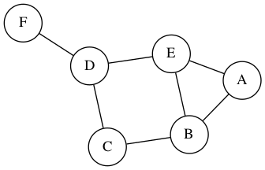
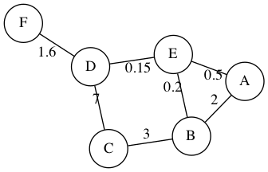
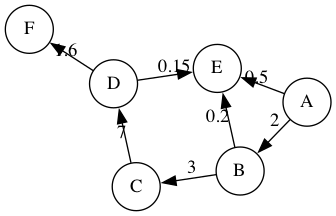

# Rosmontis

Rosmontis is a lightweight library that outputs a graph image using [graphviz](https://github.com/xflr6/graphviz) based on the adjacency list, dictionary, or matrix. This module simplified the steps of creating a graph, where it adds the nodes and edges automatically from the input data to graphviz, creating the graph in one function call.

## Installation

1. Currently, `rosmontis` only supports Python 3. Use `pip` to install:

```shell
$ pip install --upgrade rosmontis
```

2. You also need to have `graphviz` installed in order to generate the image based on the `.dot` files. See the official website for the installation process: [Graphviz.org](https://graphviz.org/download/).

## Usage & Examples

### Unweighted Undirected Graph in Adjacency List

```python
import rosmontis

g = [['A', ['B', 'E']],   # node A is connected to node B and node E
     ['B', ['E', 'C']],   # node B is connected to node E and node C
     ['C', ['D']], 
     ['D', ['E', 'F']]]

# output a png image representing the graph in the same
# directory of this file.
rosmontis.renderGraphList(graph=g, graphName="example1", weighted=False, directed=False)
```


### Weighted Undirected Graph in Adjacency Dictionary

```python
import rosmontis

# node A is connected to node B with weight of 2, and node E with weight of 0.5
# node B is connected to node E with weight of 0.2, and node C with weight of 3
# ... etc
g = {'A': [['B', 2], ['E', 0.5]], 
     'B': [['E', 0.2], ['C', 3]], 
     'C': [['D', 7]], 
     'D': [['E', 0.15], ['F', 1.6]]}

rosmontis.renderGraphDict(graph=g, graphName="example2", weighted=True, directed=False)
```



### Unweighted Undirected Graph in Adjacency Matrix

```python
import rosmontis

# Note column 0 and row 0 are the headers/labels of each node. The actual weight
# starts from row 1 column 1
# 1 indicates there is an edge, 0 indicates no connection
g = [[None, "A", "B", "C", "D", "E", "F"],
     ["A",   0,   0,   0,   0,   1,   1 ],
     ["B",   0,   0,   1,   0,   0,   1 ],
     ["C",   0,   1,   0,   1,   0,   0 ],
     ["D",   0,   0,   1,   0,   1,   1 ],
     ["E",   1,   0,   0,   1,   0,   1 ],
     ["F",   1,   1,   0,   1,   1,   0 ]]

rosmontis.renderGraphMatrix(graph=g, graphName="example3", weighted=False, directed=False)
```


### Weighted Directed Graph in Adjacency Matrix

```python
import rosmontis

# Change the numbers from 1 to the weight value. Numbers other than 0 represents
# a connection, vice versa.
g = [[None, "A",   "B",   "C",   "D",   "E",   "F"  ],
     ["A",   0,     2,     0,     0,     0,     3   ],
     ["B",   0,     0,     0,     0,     0.2,   0   ],
     ["C",   0,     0,     0,     7.5,   0,     13  ],
     ["D",   0,     0,     0,     0,     0,     1.6 ],
     ["E",   0,     0,     0,     0,     0,     -4  ],
     ["F",   0,     0,     0,     0,     0,     0   ]]

rosmontis.renderGraphMatrix(graph=g, graphName="example4", weighted=True, directed=True)
```


See more examples in the `examples/` folder.
