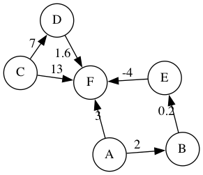

# Rosmontis

Rosmontis is a lightweight library that outputs a graph image using [graphviz](https://github.com/xflr6/graphviz) based on the adjacency list, adjacency dictionary, or adjacency matrix. This library skips the process of adding the nodes manually and only need to pass the variable representing the graph into the functions.

## Installation

1. Currently, `rosmontis` only supports Python 3. Use `pip` to install:

```shell
$ pip install --upgrade rosmontis
```

2. You also need to have `graphviz` installed in order to generate the image based on the `.dot` files. See the official website for the installation process: [Graphviz.org](https://graphviz.org/download/).

## Usage & Examples

### Unweighted Undirected Graph in Adjacency List

```python
from rosmontis import renderGraphList

g = [['A', ['B', 'E']],   # node A is connected to node B and node E
     ['B', ['E', 'C']],   # node B is connected to node E and node C
     ['C', ['D']], 
     ['D', ['E', 'F']]]

# output a png image representing the graph in the same
# directory of this file.
renderGraphList(graph=g, graphName="example1", weighted=False, directed=False)
```


### Weighted Undirected Graph in Adjacency Dictionary

```python
from rosmontis import renderGraphDict

# node A is connected to node B with weight of 2, and node E with weight of 0.5
# node B is connected to node E with weight of 0.2, and node C with weight of 3
# ... etc
g = {'A': [['B', 2], ['E', 0.5]], 
     'B': [['E', 0.2], ['C', 3]], 
     'C': [['D', 7]], 
     'D': [['E', 0.15], ['F', 1.6]]}

renderGraphDict(graph=g, graphName="example2", weighted=True, directed=False)
```


### Unweighted Undirected Graph in Adjacency Matrix

```python
from rosmontis import renderGraphMatrix

# Note the zeroth column and row are the headers/labels of each node. The actual 
# weight starts from row 1 column 1
g = [[None, "A", "B", "C", "D", "E", "F"],
     ["A",   0,   1,   0,   0,   1,   0 ],
     ["B",   1,   0,   1,   0,   1,   0 ],
     ["C",   0,   1,   0,   1,   0,   0 ],
     ["D",   0,   0,   1,   0,   1,   1 ],
     ["E",   1,   1,   0,   1,   0,   0 ],
     ["F",   0,   0,   0,   1,   0,   0 ]]

renderGraphMatrix(graph=g, graphName="example3", weighted=False, directed=False)
```


### Weighted Directed Graph in Adjacency Matrix

```python
from rosmontis import renderGraphMatrix

g = [[None, "A",   "B",   "C",   "D",   "E",   "F"  ],
     ["A",   0,     2,     0,     0,     0.5,   0   ],
     ["B",   0,     0,     3,     0,     0.2,   0   ],
     ["C",   0,     0,     0,     7,     0,     0   ],
     ["D",   0,     0,     0,     0,     0.15,  1.6 ],
     ["E",   0,     0,     0,     0,     0,     0   ],
     ["F",   0,     0,     0,     0,     0,     0   ]]

renderGraphMatrix(graph=g, graphName="example4", weighted=True, directed=True)
```


See more examples in the `examples/` folder.

